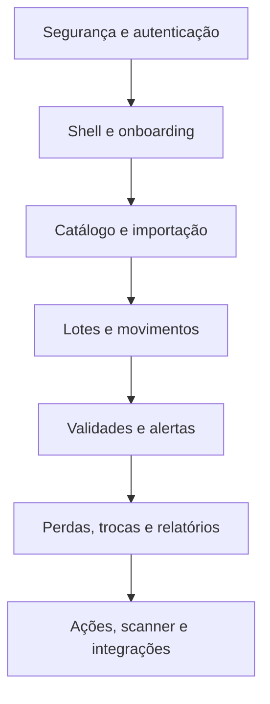

# Prazor — backlog priorizado

## 1. Critérios de prioridade

- **P0:** bloqueia segurança, ativação ou fluxo principal.
- **P1:** aumenta eficiência e retenção logo após o MVP.
- **P2:** diferenciação e escala, após evidência de uso.

Cada item só está concluído quando funciona no celular e desktop, respeita RLS, registra erros, possui estado vazio e tem teste do caminho principal.

## 2. Release 0 — segurança e fundação

**Progresso em 21/08/2026:** SEC-01, APP-01, APP-02 e APP-03 possuem a primeira implementação funcional. Permanecem a ativação da proteção contra senhas vazadas, os testes automatizados completos de RLS e papéis e a configuração de observabilidade antes do piloto.

| ID | Entrega | Prioridade | Critério de aceite resumido |
|---|---|---:|---|
| SEC-01 | Auditoria das funções privilegiadas | P0 | nenhuma função permite operar outra empresa ou papel não autorizado; testes negativos passam |
| SEC-02 | Proteção de autenticação | P0 | senhas comprometidas bloqueadas; recuperação e verificação de e-mail testadas |
| SEC-03 | Testes de RLS | P0 | owner/admin/manager/staff de duas empresas só acessam o escopo permitido |
| SEC-04 | Revisão de schemas/extensões | P0 | `pg_net` e funções internas têm localização e privilégios documentados e mínimos |
| APP-01 | Configuração Supabase por ambiente | P0 | cliente usa apenas chave publicável; segredos ficam no servidor; produção e preview separados |
| APP-02 | Sessão e rotas protegidas | P0 | usuário anônimo não abre `/app`; sessão expirada retorna ao login sem vazamento |
| APP-03 | Estrutura base do app | P0 | shell responsivo, navegação, seletor de empresa/unidade, loading e erros globais |
| OBS-01 | Logs e tratamento de falhas | P0 | falhas críticas têm contexto e identificador sem expor dados sensíveis |

**Saída da release:** aplicação conectada ao banco com autenticação e isolamento comprovados.

## 3. Release 1 — MVP operacional

### Épico A — ativação

| ID | História | Prioridade | Critérios de aceite |
|---|---|---:|---|
| ONB-01 | Criar conta e empresa | P0 | usuário cria empresa, vira owner e recebe configurações padrão atomicamente |
| ONB-02 | Criar unidade e local | P0 | primeira unidade/local podem ser criados no onboarding e aparecem no seletor |
| ONB-03 | Checklist inicial | P0 | progresso reflete estrutura, produto, lote e convite reais |
| TEAM-01 | Convidar equipe | P0 | owner/admin convida, define papel/escopo e pode suspender acesso |

### Épico B — catálogo e dados

**Progresso em 21/08/2026:** CAT-01 e CAT-02 já possuem a primeira versão funcional, incluindo cadastro transacional com SKU, código de barras, unidade e preços. Categorias, marcas, edição e importação permanecem para os próximos ciclos.

| ID | História | Prioridade | Critérios de aceite |
|---|---|---:|---|
| CAT-01 | Listar e buscar produtos | P0 | busca por nome, SKU e código; filtros persistem na URL |
| CAT-02 | Criar/editar produto | P0 | valida duplicidade, campos obrigatórios e empresa relacionada |
| CAT-03 | Categorias, marcas e códigos | P0 | manutenção simples sem duplicações na mesma empresa |
| SUP-01 | Fornecedores | P0 | cadastro, edição, situação e histórico visíveis conforme papel |
| IMP-01 | Importar planilha | P0 | prévia separa válidos/erros; confirmação é idempotente; relatório aponta linha e campo |
| IMP-02 | Modelo de arquivo | P0 | usuário baixa exemplo com instruções e valores aceitos |

### Épico C — estoque e validade

**Progresso em 21/08/2026:** INV-01, INV-03, INV-04, EXP-01, EXP-02, EXP-03 e LOS-01 já possuem a primeira versão funcional. O recebimento valida empresa, papel, produto, local, fornecedor, datas, quantidade e custo; lote, movimento e saldo são confirmados na mesma transação. A tela de movimentações registra saída, transferência, ajuste e retorno, impede saldo negativo, exige motivo e preserva o histórico operacional. Perdas e avarias baixam o saldo atomicamente, congelam o custo, usam motivos padronizados e alimentam um histórico financeiro. A Central de Validades reúne indicadores por faixa, busca por produto/SKU/lote, filtros persistentes por status e local, ordenação por urgência/valor/saldo e atalhos contextuais. Cada lote agora possui uma visão própria com saldo por localização, risco, recomendação, dados de origem, perdas, trocas, alertas e linha do tempo operacional. Filtros complementares e testes automatizados completos permanecem para os próximos ciclos.

| ID | História | Prioridade | Critérios de aceite |
|---|---|---:|---|
| INV-01 | Receber lote | P0 | entrada cria lote/movimento/saldo em transação única; duplicidade é tratada |
| INV-02 | Consultar saldos | P0 | filtros por produto, lote, unidade e local; total confere com movimentos |
| INV-03 | Transferir estoque | P0 | origem e destino atualizam atomicamente; saldo negativo é impossível |
| INV-04 | Saída e ajuste | P0 | permissão e motivo são validados; correção não apaga histórico |
| EXP-01 | Painel de validade | P0 | faixas usam fuso e limites da empresa e consideram apenas saldo positivo |
| EXP-02 | Central de validades | P0 | filtros, ordenação, custo em risco e link para lote funcionam |
| EXP-03 | Detalhe do lote | P0 | saldos, eventos, alertas, perdas e trocas ficam em uma visão |
| LOS-01 | Registrar perda | P0 | baixa e perda são atômicas; custo e autoria ficam congelados no registro |

### Épico D — alertas e fornecedores

**Progresso em 25/08/2026:** NOT-01 e NOT-02 possuem a primeira versão funcional, e NOT-03 agora conta com a infraestrutura e a interface operacional. A Central de Notificações reúne alertas privados por usuário, busca, filtros persistentes de leitura, severidade e período, agrupamento por data, marcação individual ou em massa e acesso direto à entidade relacionada. Cada usuário configura canais, marcos de antecedência, resumo diário, horário e fuso. A fila de e-mail respeita esses marcos, agenda o resumo no fuso escolhido, agrupa eventos, usa idempotência, recupera processamentos travados, aplica até três tentativas com espera progressiva e expõe histórico e reenvio manual seguro. A ativação de envios reais ainda depende da credencial Resend e de um domínio remetente verificado; WhatsApp permanece para um ciclo posterior.

**Progresso em 25/08/2026 — fornecedores:** SUP-01 e EXC-01 possuem a primeira versão funcional. A nova central cadastra e edita fornecedores, controla situação, evita documentos duplicados e mostra histórico conforme o papel. Os acordos registram vigência, antecedência mínima, compensação, frete, nota fiscal, fotos, autorização prévia e observações; o banco impede períodos inválidos, valores fora do limite e mais de um acordo ativo por fornecedor. A cobertura operacional, acordos vencendo e parceiros sem regra vigente ficam visíveis no painel. O próximo ciclo usará essas condições para validar a elegibilidade e abrir solicitações de troca.

**Progresso em 25/08/2026 — trocas:** EXC-02 possui a primeira versão funcional. A central cruza lote, saldo por local, fornecedor e acordo vigente; identifica prazo ultrapassado, parceiro inativo, ausência de cobertura e quantidade já comprometida. A criação congela as condições negociadas, reserva logicamente o saldo em uma transação protegida contra concorrência e impede promessas acima da disponibilidade. O acompanhamento registra protocolo e transições válidas; coleta ou envio produz a baixa rastreável do estoque, enquanto cancelamento ou recusa libera a reserva. O próximo ciclo detalhará aceite parcial, crédito, reposição e valor efetivamente recuperado.

**Progresso em 29/08/2026 — conclusão de trocas:** EXC-03 possui a primeira versão funcional. A conclusão registra aceite total ou parcial, quantidade não aceita, reposição, crédito ou compensação mista e calcula o valor efetivamente recuperado. A operação é atômica e idempotente: cria a resolução uma única vez, encerra a reserva, baixa apenas a quantidade aceita quando ainda não houve saída e devolve ao saldo a parte recusada quando o material já havia sido coletado ou enviado. Relatórios e histórico passam a usar o valor realizado, não o valor inicialmente solicitado.

| ID | História | Prioridade | Critérios de aceite |
|---|---|---:|---|
| NOT-01 | Notificação no app | P0 | alertas são deduplicados, filtráveis e abrem a entidade correta |
| NOT-02 | Preferências | P0 | usuário configura canais, limites e resumo no próprio fuso |
| NOT-03 | E-mail de alerta/resumo | P0 | entrega tem tentativas, status e não duplica o mesmo evento |
| EXC-01 | Acordo de fornecedor | P0 | antecedência mínima e período de vigência são validados |
| EXC-02 | Solicitar troca | P0 | lotes elegíveis geram protocolo e movimentação/reserva rastreável |
| EXC-03 | Concluir troca | P0 | aceita parcial, crédito/reposição e valor recuperado são registrados |

### Épico E — gestão

| ID | História | Prioridade | Critérios de aceite |
|---|---|---:|---|
| DASH-01 | Visão geral | P0 | cartões e “Aja agora” abrem os dados de origem e respeitam escopo |
| REP-01 | Relatório de perdas | P0 | valor/quantidade por período, motivo, produto e unidade reconciliam com registros |
| REP-02 | Relatório de risco | P0 | valor por faixa de validade reconcilia com saldos e custos dos lotes |
| AUD-01 | Histórico operacional | P0 | usuário autorizado identifica quem, quando e o que mudou |
| SET-01 | Configurações de validade | P0 | limites válidos são salvos e refletem no painel sem reescrever histórico |

**Saída da release:** empresa completa o ciclo cadastro → lote → risco → alerta → movimentação/perda/troca → relatório.

## 4. Release 1.1 — execução no chão de loja

| ID | Entrega | Prioridade | Critério de aceite resumido |
|---|---|---:|---|
| ACT-01 | Modelo e lista de ações | P1 | ação tem responsável, prazo, prioridade, status e vínculo ao lote |
| ACT-02 | Concluir ação e medir resultado | P1 | quantidade e desfecho conciliam com movimento/perda/troca vinculada |
| ACT-03 | Escalonar atrasos | P1 | responsável e gerente recebem apenas uma escalada por regra |
| SCN-01 | Scanner de código de barras | P1 | câmera encontra produto e abre recebimento, consulta, movimento ou perda |
| PWA-01 | Experiência instalável | P1 | app pode ser instalado e lida claramente com conexão instável |
| CNT-01 | Contagem de estoque | P1 | sessão suporta rascunho, divergência, aprovação e ajuste rastreável |
| WHA-01 | Alertas por WhatsApp | P1 | opt-in, templates, tentativas e cancelamento são respeitados |
| BIL-01 | Cobrança pública | P1 | trial, assinatura, webhook idempotente, limites e portal do cliente funcionam |

## 5. Release 2 — escala e inteligência

| ID | Entrega | Prioridade | Resultado esperado |
|---|---|---:|---|
| INT-01 | API e webhooks | P2 | integração segura e idempotente com sistemas externos |
| INT-02 | Conectores ERP/PDV | P2 | sincronizar produtos, estoque e vendas sem duplicar eventos |
| PRM-01 | Campanhas de promoção | P2 | relacionar desconto, quantidade vendida e valor protegido |
| ANA-01 | Comparação entre unidades | P2 | benchmark operacional com escopo e período equivalentes |
| ANA-02 | Previsão de risco | P2 | priorização usa histórico de venda e validade com explicação |
| REC-01 | Recall e bloqueio | P2 | localizar e bloquear lotes afetados com rastreabilidade |
| DON-01 | Doações | P2 | destinação, comprovante e valor social registrados |

## 6. Release 3 — automação avançada

- OCR de nota, etiqueta e validade com confirmação humana;
- sugestão automática de preço e transferência;
- assistente de análise em linguagem natural;
- previsão de compra e ruptura;
- marketplace ou rede de doação, após validação jurídica e operacional;
- módulos verticais para restaurante, cosméticos, pet e farmácia.

## 7. Dependências e ordem recomendada

Não iniciar scanner, IA ou integrações antes de o fluxo manual estar correto e mensurável.

## 8. Definição de pronto

Uma história está pronta somente quando:

- regra de negócio e permissão estão implementadas no servidor/banco;
- RLS foi testada com empresa e usuário adversários;
- interface funciona em celular e desktop;
- loading, vazio, erro e sucesso estão tratados;
- operação crítica tem idempotência ou confirmação adequada;
- eventos sensíveis entram na auditoria;
- métricas e logs não expõem dados pessoais ou segredos;
- teste automatizado cobre o caminho principal e ao menos uma negação;
- texto da interface está em português brasileiro e é compreensível sem treinamento.
