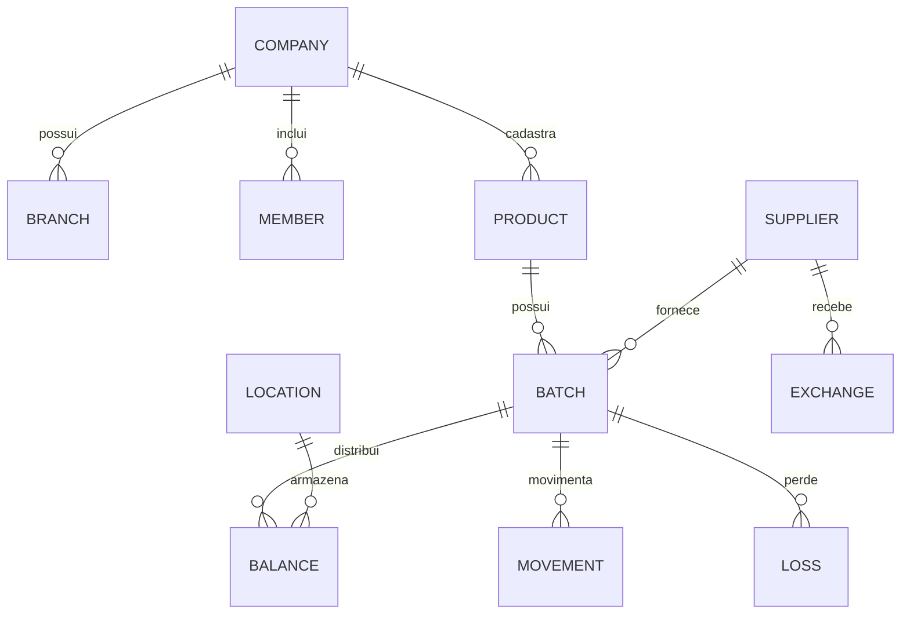

# Prazor — modelo de dados e segurança

## 1. Estado atual

O projeto Supabase **Prazor Produção** já possui um modelo multiempresa amplo, com migrações para estoque, validade, alertas, trocas, auditoria e cobrança. Não deve ser reconstruído. Novas alterações devem ser incrementais, versionadas e testadas.

### Domínios existentes

| Domínio | Objetos principais | Situação |
|---|---|---|
| Identidade | `profiles` | existente |
| Multiempresa | `companies`, `company_members`, `member_scopes` | existente |
| Estrutura | `branches`, `departments`, `stock_locations` | existente |
| Catálogo | `categories`, `brands`, `products`, `product_barcodes`, `suppliers` | existente |
| Estoque | `batches`, `inventory_balances`, `inventory_movements` | existente |
| Perdas | `loss_reasons`, `losses` | existente |
| Fornecedores | `supplier_agreements`, `exchange_requests`, `exchange_request_items` | existente |
| Alertas | `notification_preferences`, `notifications`, `notification_deliveries` | existente |
| Dados | `imports`, `import_errors`, `audit_logs` | existente |
| Cobrança | planos, preços, clientes, assinaturas e eventos | existente |
| Configuração | `company_settings` | existente |
| Leitura de risco | `v_batch_expiry` | existente e `security_invoker=true` |

Todas as tabelas expostas auditadas estão com RLS habilitado e possuem políticas. As tabelas operacionais imutáveis, como saldos e movimentos, expõem leitura direta e usam funções transacionais para escrita.

## 2. Relações centrais

Em todas as relações multiempresa, `company_id` é uma fronteira de segurança, não apenas um filtro de interface.

## 3. Extensões necessárias ao modelo

### P0 — completar o fluxo de ação

#### `actions`

- empresa, unidade, local, produto e lote opcionais conforme contexto;
- tipo, status, prioridade, origem e instrução;
- responsável, criador, prazo, início e conclusão;
- quantidade alvo e tratada;
- desfecho e valores protegido, recuperado ou perdido;
- movimento, perda ou troca vinculada;
- timestamps e versão para concorrência.

#### `action_comments` e `attachments`

- conversa operacional e evidências;
- arquivos em bucket privado;
- metadados de tipo, tamanho, autor e entidade vinculada;
- URLs assinadas de curta duração.

### P1 — operação ampliada

#### Recebimentos

`inventory_receipts` e `inventory_receipt_items` agrupam vários lotes sob fornecedor, documento, data, usuário e observação. Isso dá rastreabilidade à entrada e simplifica importação/integração.

#### Contagem de estoque

`inventory_counts` e `inventory_count_items` suportam rascunho, contagem cega, divergência, aprovação e geração de ajuste.

#### Regras e escalonamento

`alert_rules` e `alert_escalations` permitem critérios por categoria, fornecedor, unidade, valor e faixa, mantendo os limites atuais como padrão simples.

#### Integrações

`integration_connections`, `sync_jobs`, `sync_errors` e `webhook_events` registram conexão, cursor, idempotência, tentativas e diagnóstico sem armazenar segredo em texto aberto.

### P2 — inteligência comercial

- `promotion_campaigns` e itens para ações de remarcação;
- `recalls` para bloqueio de lotes;
- `donations` e destinatários;
- snapshots analíticos para relatórios pesados;
- regras de validade após abertura para verticais específicas.

## 4. Evolução do catálogo

Campos candidatos para `products`:

- imagem;
- conteúdo da embalagem e fator de conversão;
- estoque mínimo e máximo;
- prazo de validade padrão;
- antecedência mínima aceitável no recebimento;
- condição de armazenamento;
- margem mínima para promoção;
- indicação de validade obrigatória ou opcional.

Campos candidatos para `batches`:

- item de recebimento de origem;
- estado: disponível, quarentena, reservado para troca, bloqueado ou encerrado;
- motivo de bloqueio;
- metadados de origem/importação;
- data de abertura e validade após abertura somente nas verticais que exigirem.

Campos novos só devem ser criados quando uma tela, regra ou integração do backlog for implementada.

## 5. Modelo de autorização

### Princípios

- todo acesso usa usuário autenticado;
- RLS é obrigatória em toda tabela exposta;
- participação ativa em `company_members` determina acesso à empresa;
- papel determina capacidade; `member_scopes` limita unidade e setor;
- a interface nunca é considerada barreira de segurança;
- decisões de autorização não usam `user_metadata` editável pelo usuário;
- chave de serviço existe apenas em backend/worker e nunca no navegador;
- operações financeiras ou de estoque usam funções transacionais com validação explícita.

### Matriz de capacidade

| Capacidade | Owner | Admin | Manager | Staff |
|---|---:|---:|---:|---:|
| Ver dados do escopo | sim | sim | sim | sim |
| Cadastrar catálogo | sim | sim | sim | sim, se habilitado |
| Publicar movimento | sim | sim | sim | sim, no escopo |
| Registrar perda | sim | sim | sim | sim, no escopo |
| Aprovar ajuste/troca | sim | sim | sim | não |
| Gerir equipe e escopo | sim | sim | limitado | não |
| Alterar empresa/limites | sim | sim | não | não |
| Plano e cobrança | sim | não | não | não |
| Consultar auditoria ampla | sim | sim | limitada | não |

## 6. Achados da auditoria de segurança

### Bloqueadores antes do piloto

1. ~~Revisar as funções `SECURITY DEFINER` executáveis por usuários autenticados.~~ **Concluído na Release 0:** as funções mantêm `search_path` vazio, validam autenticação/empresa/papel/escopo, negam execução anônima e usam um núcleo interno não executável pelo cliente. Perdas e trocas só podem movimentar saldo por suas operações dedicadas, ajustes ficaram restritos a gestores e sobrescrita do custo de perda também exige gestão.
2. Manter funções internas privilegiadas fora do schema exposto quando não precisarem ser chamadas pelo cliente.
3. Ativar proteção contra senhas comprometidas no Supabase Auth.
4. Revisar a extensão `pg_net` instalada no schema `public` e, se tecnicamente seguro, movê-la para schema dedicado em migração planejada.
5. Executar testes automatizados de isolamento entre duas empresas e quatro papéis.

### Validações positivas

- RLS está habilitado nas tabelas públicas auditadas;
- há políticas de acesso para os objetos expostos;
- a view `v_batch_expiry` usa `security_invoker=true`;
- escritas sensíveis de saldo/movimento já foram orientadas a funções transacionais;
- existe trilha de auditoria e deduplicação de notificações.
- a migração `harden_inventory_rpc_boundaries` foi aplicada e verificada: `anon` não executa movimentações, `authenticated` não chama o núcleo interno e os guardas dos fluxos dedicados estão presentes.
- as operações `create_product_with_barcode` e `receive_inventory_lot` foram adicionadas como pontos transacionais controlados: negam acesso anônimo, exigem papel de gestão, validam todas as relações pela empresa e mantêm `search_path` vazio.
- a interface de movimentações passou a usar exclusivamente `post_inventory_movement`: a empresa é derivada da sessão no servidor, perdas e trocas continuam bloqueadas nesse ponto genérico, ajustes exigem papel de gestão, origem/destino respeitam o escopo e o núcleo transacional impede saldo negativo.
- o fluxo de perdas usa exclusivamente `record_loss`: a empresa é derivada da sessão, motivo e local são validados, o custo é congelado, sobrescritas exigem papel de gestão e saldo, movimento, prejuízo e auditoria são gravados na mesma transação. Motivos padrão são criados automaticamente para empresas novas e foram preparados para empresas existentes.

### Performance

O advisor reporta apenas índices ainda não utilizados. Como o projeto ainda tem pouco tráfego, isso não justifica removê-los agora. A revisão deve ocorrer depois do piloto com estatísticas reais, planos de consulta e volume representativo.

## 7. Regras técnicas para novas mudanças

- migrations SQL pequenas, reversíveis e com nome descritivo;
- constraints para quantidade positiva, datas coerentes e estados válidos;
- chaves estrangeiras indexadas quando participarem de joins/filtros reais;
- `company_id` validado nas funções e nas políticas;
- políticas de `UPDATE` com `SELECT`, `USING` e `WITH CHECK` coerentes;
- views expostas sempre com `security_invoker=true`;
- arquivos em buckets privados com política por empresa;
- idempotência em importações, webhooks, notificações e recebimentos;
- saldo modificado apenas na mesma transação do movimento;
- dados de auditoria sem segredos e com retenção definida;
- testes de autorização fazem parte do critério de aceite, não de uma etapa opcional.

## 8. Estratégia de ambientes

- **produção:** banco atual, protegido de experimentos;
- **desenvolvimento:** branch/projeto separado com dados sintéticos;
- **preview:** migrações aplicadas antes da interface correspondente;
- segredos separados por ambiente;
- promoção para produção somente após teste de migração, RLS e fluxo de ponta a ponta.

Nenhuma nova estrutura deve ser criada diretamente em produção sem migração final revisada.
