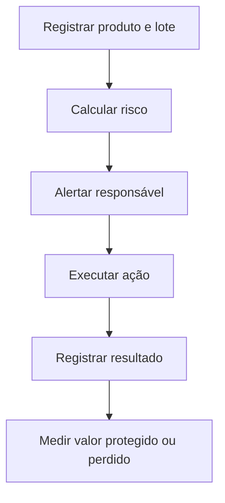

# Prazor — blueprint do produto

## 1. Visão

**Proposta:** uma plataforma de controle de validade e estoque que avisa o que exige atenção, orienta a ação correta e mede quanto prejuízo foi evitado.

**Promessa:** “Seu estoque avisa antes de virar prejuízo.”

**Posicionamento:** camada operacional especializada em validade, lote e prevenção de perdas. Pode funcionar sozinha no início e integrar-se a ERPs e PDVs depois.

## 2. Público inicial

### Segmento principal do MVP

- mercados de bairro e mercearias;
- lojas de conveniência;
- pequenos distribuidores de alimentos e bebidas;
- operações com uma ou poucas unidades e controle atual em planilhas, cadernos ou memória da equipe.

### Expansão posterior

- cosméticos e perfumaria;
- pet shops e distribuidores veterinários;
- restaurantes e cozinhas, com regras de validade após abertura;
- farmácias, com requisitos regulatórios próprios.

### Personas

| Persona | Necessidade principal | Uso do Prazor |
|---|---|---|
| Proprietário | reduzir perdas e enxergar retorno | indicadores, relatórios e configuração |
| Gerente | priorizar o trabalho diário | dashboard, alertas, tarefas e aprovações |
| Estoquista | registrar rápido e sem erro | câmera, produto, lote, movimentação e contagem |
| Comprador | negociar e prevenir compras ruins | fornecedores, acordos, trocas e histórico |

## 3. Problema e resultado esperado

Hoje, produtos vencem porque o dado não existe, está disperso ou não chega a quem precisa agir. O Prazor fecha esse ciclo:

## 4. Princípios do produto

1. **Ação antes de relatório:** toda informação crítica deve sugerir o próximo passo.
2. **Velocidade no chão de loja:** operações frequentes precisam funcionar bem no celular.
3. **Lote é a unidade operacional:** validade e saldo são controlados por lote e localização.
4. **FEFO por padrão:** recomendar primeiro o lote que vence primeiro.
5. **Rastreabilidade:** alterações sensíveis deixam histórico e autoria.
6. **Configuração sem complexidade:** começar com padrões úteis e permitir ajustes por empresa.
7. **Foco:** não competir com financeiro, folha, CRM, frente de caixa ou emissão fiscal.

## 5. Métrica central e indicadores

### Métrica norte

**Valor protegido pelo Prazor:** custo dos itens cuja perda provável foi evitada por uma ação registrada, como venda priorizada, transferência, troca ou devolução.

No MVP, o valor será declarado a partir das ações concluídas e validado pelos movimentos de estoque vinculados. Em versões futuras, poderá ser estimado por modelos preditivos.

### Indicadores principais

- valor de estoque vencido, crítico e em atenção;
- quantidade de lotes por faixa de validade;
- perdas em quantidade e valor, por período e motivo;
- valor recuperado por troca/devolução;
- ações abertas, atrasadas e concluídas;
- tempo médio entre alerta e ação;
- cobertura de cadastro: produtos com lote, validade e custo;
- giro e ruptura, quando houver integração de venda.

## 6. Escopo funcional

### Núcleo operacional

- autenticação, empresa, unidades, setores, locais de estoque e equipe;
- cadastro de produtos, categorias, marcas, códigos de barras e fornecedores;
- lotes com validade, origem, custo e saldo por localização;
- entrada, saída, transferência, ajuste, perda, troca e devolução;
- painel por risco de validade e valor financeiro;
- alertas no aplicativo e por e-mail; WhatsApp entra na fase seguinte;
- importação por planilha com relatório de erros;
- acordos e solicitações de troca com fornecedores;
- histórico e trilha de auditoria;
- planos e assinatura.

### Camada de ação

- criar uma ação a partir de um alerta ou lote;
- atribuir responsável e prazo;
- tipos: expor primeiro, transferir, promover, negociar troca, devolver, doar, descartar ou conferir;
- anexar evidência e observação;
- concluir com quantidade tratada e resultado financeiro;
- escalar tarefas vencidas ao gerente.

### Gestão e inteligência

- ranking de perdas por produto, categoria, unidade e fornecedor;
- tendência mensal de perda;
- produtos recorrentes próximos do vencimento;
- desempenho de fornecedores em trocas;
- resumo diário e semanal;
- comparativo entre unidades;
- exportação CSV/PDF em fase posterior ao relatório web.

## 7. Escopo do primeiro produto utilizável

O MVP termina quando uma empresa consegue, sem ajuda técnica:

1. criar conta, empresa, unidade e local de estoque;
2. importar ou cadastrar produtos;
3. receber um lote com quantidade, custo e validade;
4. enxergar o risco no painel;
5. receber um alerta;
6. registrar a ação e a movimentação correspondente;
7. registrar uma perda ou troca;
8. consultar o impacto financeiro e a auditoria.

### Fora do MVP

- PDV ou frente de caixa;
- emissão de NF-e/NFC-e;
- contas a pagar/receber e contabilidade;
- folha de pagamento;
- CRM e e-commerce;
- marketplace de produtos próximos do vencimento;
- previsão com inteligência artificial;
- OCR de nota fiscal e rótulo;
- regras especializadas de farmácia ou validade após abertura.

## 8. Regras de negócio

### Faixas de validade

Os limites são configuráveis por empresa. O padrão atual é:

| Estado | Regra padrão |
|---|---|
| Vencido | data de validade anterior a hoje |
| Crítico | vence entre hoje e 7 dias |
| Atenção | vence entre 8 e 30 dias |
| Monitoramento | vence entre 31 e 90 dias |
| Regular | vence depois de 90 dias |

- somente lotes ativos com saldo positivo entram nos indicadores acionáveis;
- o dia corrente é calculado no fuso da empresa, inicialmente `America/Recife`;
- alterações nos limites recalculam a classificação, mas não alteram o histórico de ações.

### Estoque e lote

- saldo nunca é editado diretamente pela interface; ele deriva de movimentos válidos;
- uma saída não pode deixar saldo negativo;
- transferências criam saída e entrada vinculadas em uma única operação atômica;
- movimentos publicados são imutáveis; correções usam movimento inverso ou ajuste identificado;
- produto, lote e localização precisam pertencer à mesma empresa;
- a sugestão de separação segue FEFO, respeitando bloqueios e quarentena;
- lote vencido não pode ser disponibilizado para venda normal.

### Perdas e trocas

- perda exige motivo, quantidade, localização e autoria;
- o valor total usa o custo do lote no momento do registro;
- uma perda reduz estoque e cria movimento vinculado;
- solicitação de troca reserva ou transfere o saldo para uma localização de quarentena/troca;
- conclusão de troca registra quantidade aceita, recusada e valor recuperado;
- cancelamento devolve o saldo reservado à localização anterior quando aplicável.

### Alertas e tarefas

- o mesmo evento não deve gerar alertas duplicados para o mesmo usuário e limiar;
- confirmação de leitura não encerra o risco; somente uma ação ou mudança do lote resolve o item;
- alertas críticos não tratados podem ser escalados;
- preferências de canal são individuais, limites operacionais são da empresa;
- toda tarefa concluída deve informar desfecho e quantidade tratada.

### Acesso

| Papel | Acesso resumido |
|---|---|
| Proprietário | tudo, inclusive cobrança, empresa e exclusões controladas |
| Administrador | operação e configuração, sem titularidade/cobrança restrita |
| Gerente | operação, equipe dentro do escopo, relatórios e aprovações |
| Operador | cadastro e execução operacional dentro do escopo atribuído |

O acesso pode ser restringido por unidade e setor. Um papel somente leitura/auditor poderá ser incluído depois.

## 9. Estratégia de lançamento

1. piloto com 2 a 5 operações reais de varejo alimentar;
2. implantação assistida por planilha;
3. acompanhamento semanal de cadastro, alertas, ações e perdas;
4. validar valor protegido e tempo economizado;
5. só então ativar cobrança pública e aquisição em escala.

### Critérios para sair do piloto

- nenhuma falha de isolamento entre empresas;
- fluxo principal utilizável no celular;
- importação compreensível para usuário não técnico;
- alertas sem duplicação relevante;
- pelo menos 80% dos lotes do piloto com validade e custo;
- registro consistente de ação ou perda para os itens críticos;
- evidência de valor protegido em pelo menos três operações.
