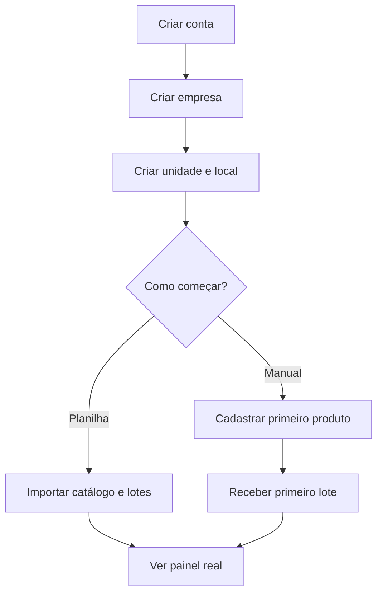
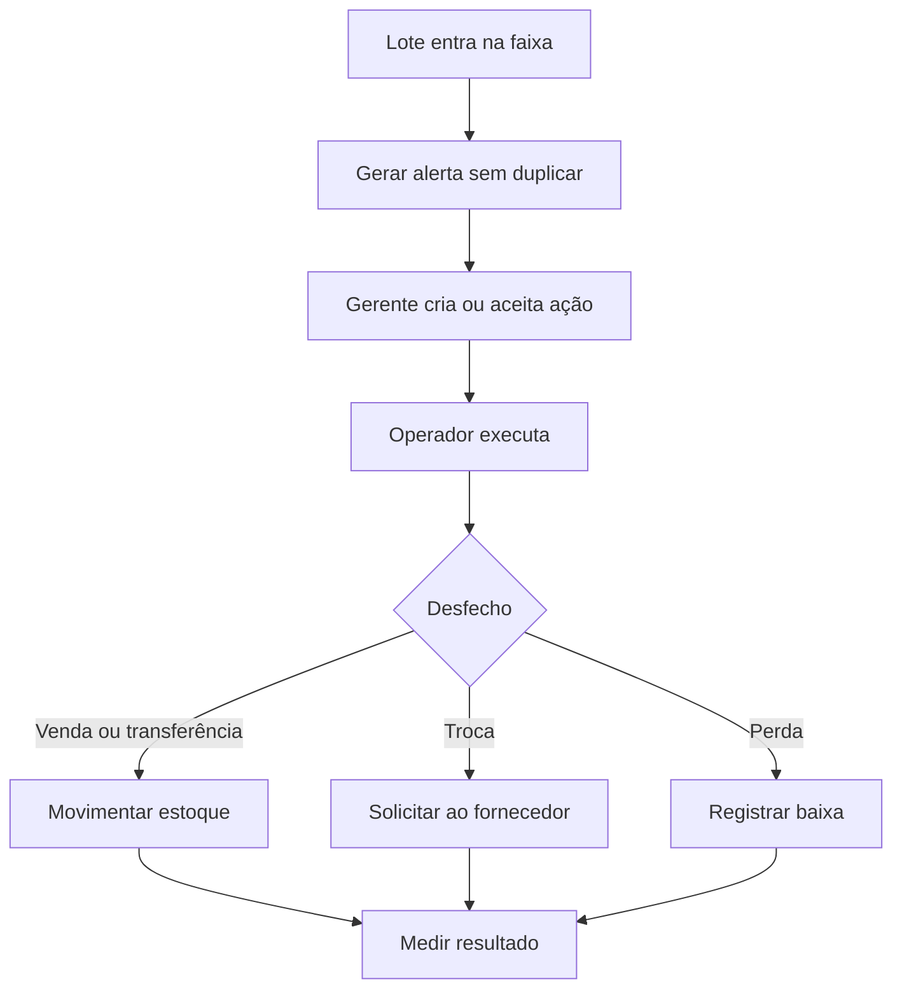

# Prazor — telas e fluxos

## 1. Arquitetura de informação

### Navegação principal

1. **Visão geral**
2. **Validades**
3. **Estoque**
4. **Ações**
5. **Fornecedores**
6. **Relatórios**
7. **Notificações**
8. **Configurações**

No celular, a navegação inferior deve priorizar Visão geral, Validades, Scanner, Ações e Mais.

## 2. Mapa de rotas

| Rota sugerida | Tela | Objetivo |
|---|---|---|
| `/entrar` | Entrar | autenticar e recuperar acesso |
| `/cadastro` | Criar conta | iniciar avaliação e aceitar termos |
| `/onboarding` | Configuração inicial | criar empresa, unidade e primeiro local |
| `/app` | Visão geral | mostrar risco, prioridade e impacto |
| `/app/validades` | Central de validades | filtrar lotes por faixa e agir em massa |
| `/app/validades/[lote]` | Detalhe do lote | reunir saldo, histórico, alertas e ações |
| `/app/estoque/produtos` | Produtos | buscar, importar e administrar catálogo |
| `/app/estoque/produtos/[produto]` | Detalhe do produto | dados, códigos, lotes e histórico |
| `/app/estoque/receber` | Receber estoque | registrar entrada de um ou vários lotes |
| `/app/estoque/movimentar` | Movimentar | saída, transferência, ajuste e descarte |
| `/app/estoque/saldos` | Saldos | consultar quantidade por lote e local |
| `/app/estoque/perdas` | Perdas | registrar e analisar perdas |
| `/app/acoes` | Ações | organizar trabalho por responsável e prazo |
| `/app/acoes/[acao]` | Detalhe da ação | executar, comprovar e concluir |
| `/app/fornecedores` | Fornecedores | cadastro, acordos e desempenho |
| `/app/fornecedores/trocas` | Trocas | montar e acompanhar solicitações |
| `/app/importacoes` | Importações | enviar arquivo e corrigir erros |
| `/app/relatorios` | Relatórios | acompanhar impacto e tendências |
| `/app/notificacoes` | Central de notificações | ler, filtrar e abrir itens relacionados |
| `/app/configuracoes/*` | Configurações | empresa, estrutura, equipe, alertas e plano |

## 3. Especificação das telas principais

### Visão geral

**Cabeçalho:** seletor de unidade, período, busca global e botão “Registrar entrada”.

**Conteúdo:**

- cartões: valor vencido, valor crítico, ações abertas, valor protegido no mês;
- distribuição por faixa de validade;
- lista “Aja agora” ordenada por severidade, dias, valor e quantidade;
- próximos vencimentos;
- ações atrasadas;
- perdas e recuperação do mês;
- atalhos para scanner, entrada, perda e importação.

**Estado vazio:** checklist de implantação com progresso e chamada para importar produtos.

### Central de validades

**Filtros:** unidade, local, status, intervalo de data, fornecedor, categoria, produto, responsável e presença de ação.

**Colunas:** produto, lote, validade, dias restantes, saldo, local, custo em risco, fornecedor e situação da ação.

**Ações:** abrir lote, criar ação, transferir, registrar perda, solicitar troca, exportar e selecionar em massa.

**Visualizações:** tabela no desktop e cartões compactos no celular. Filtros devem aparecer na URL para permitir compartilhamento e retorno.

### Detalhe do lote

- identificação do produto, lote, validade e fornecedor;
- status de validade e custo em risco;
- saldo por localização;
- ação recomendada e ações abertas;
- botões de movimentar, perder, trocar e criar ação;
- linha do tempo de recebimento, movimentos, alertas, ações e alterações;
- anexos e observações.

### Produtos

- busca por nome, SKU e código de barras;
- filtros por categoria, marca, fornecedor, ativo e qualidade do cadastro;
- ações de criar, importar, editar em massa e arquivar;
- indicadores de cadastro incompleto;
- acesso rápido aos lotes do produto.

### Receber estoque

Fluxo otimizado para celular:

1. selecionar ou ler produto;
2. informar lote e validade;
3. informar quantidade, custo, fornecedor e local;
4. validar duplicidade e prazo mínimo aceitável;
5. revisar itens;
6. confirmar entrada atômica;
7. exibir comprovante e próximos passos.

Deve permitir vários itens no mesmo recebimento e salvar rascunho local em caso de interrupção.

### Movimentar estoque

- escolher tipo de operação;
- ler produto/lote ou abrir a partir do contexto;
- escolher origem, destino e quantidade;
- exibir saldo disponível e consequência;
- exigir motivo em ajuste e descarte;
- confirmar com resumo antes de publicar.

### Perdas

- visão de ocorrências e total financeiro;
- formulário com lote, local, quantidade, motivo, nota e evidência;
- confirmação explícita, pois a operação reduz saldo;
- gráficos por motivo, categoria, produto, unidade e período;
- possibilidade de correção por lançamento inverso autorizado, sem apagar histórico.

### Ações

**Visões:** minhas ações, equipe, atrasadas, concluídas e quadro por status.

**Campos:** tipo, origem, lote/produto, unidade/local, responsável, prazo, prioridade, quantidade alvo, instrução e evidência.

**Conclusão:** desfecho, quantidade tratada, movimento vinculado, valor protegido/recuperado/perdido, nota e evidência.

### Trocas com fornecedor

1. selecionar fornecedor e acordo;
2. adicionar lotes elegíveis;
3. validar antecedência mínima e quantidade;
4. gerar solicitação e protocolo;
5. mover saldo para quarentena/troca;
6. acompanhar enviada, aceita parcialmente, concluída ou recusada;
7. registrar crédito, reposição ou devolução;
8. medir valor recuperado.

### Importações

- baixar modelo de planilha;
- enviar arquivo;
- mapear colunas quando necessário;
- pré-visualizar novos registros, atualizações, avisos e erros;
- confirmar somente linhas válidas ou corrigir antes de importar;
- mostrar progresso e relatório final por linha;
- permitir baixar erros em CSV.

### Relatórios

Abas iniciais:

- visão executiva;
- validade e risco;
- perdas;
- ações e valor protegido;
- fornecedores e trocas;
- comparação entre unidades.

Todo indicador deve abrir a lista que o compõe. Exportação respeita os mesmos filtros e escopo de acesso.

### Configurações

- **Empresa:** nome, CNPJ, logo, moeda e fuso;
- **Estrutura:** unidades, setores e locais;
- **Equipe:** convite, papel, status e escopo;
- **Validade:** limites crítico, atenção e monitoramento;
- **Alertas:** canais, horários, resumo e escalonamento;
- **Catálogo:** categorias, marcas e motivos de perda;
- **Integrações:** conexões e histórico de sincronização;
- **Plano e cobrança:** plano, uso, pagamento e faturas;
- **Auditoria:** consulta restrita de eventos.

## 4. Jornadas essenciais

### Ativação inicial

### Tratar risco de validade

### Leitura por câmera

1. abrir scanner;
2. ler código de barras;
3. encontrar o produto ou oferecer cadastro rápido;
4. selecionar ação: receber, consultar lotes, movimentar ou registrar perda;
5. preencher apenas campos ainda necessários;
6. confirmar e oferecer leitura do próximo item.

## 5. Estados e padrões transversais

Todas as telas de dados devem prever:

- carregamento com estrutura estável;
- vazio inicial com orientação;
- vazio após filtros com opção de limpar;
- erro recuperável com tentativa novamente;
- ausência de permissão sem revelar dados;
- operação offline/instável sinalizada no fluxo móvel;
- sucesso com resumo e possibilidade de abrir o registro;
- confirmação para ações financeiras ou de estoque;
- acessibilidade por teclado, contraste e rótulos explícitos.

## 6. Prioridade responsiva

O desktop favorece análise e operações em massa. O celular favorece leitura, registro e execução. Dashboard, Validades, Detalhe do lote, Recebimento, Movimentação, Perda, Ações e Scanner precisam ser projetados primeiro em largura móvel e depois ampliados.
